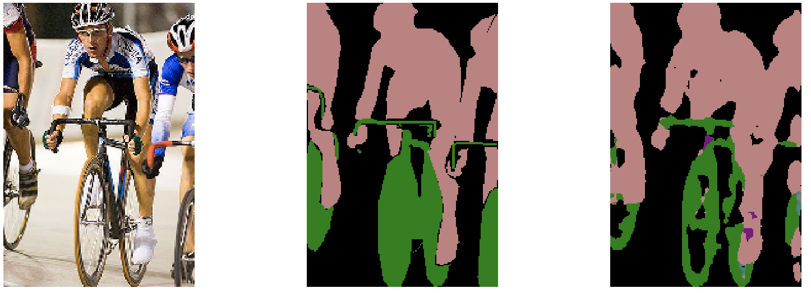

# fcn.pytorch

PyTorch implementation of [Fully Convolutional Networks](https://github.com/shelhamer/fcn.berkeleyvision.org), main code modified from [pytorch-fcn](https://github.com/wkentaro/pytorch-fcn).

### Requirements
- pytorch
- torchvision
- [ignite](https://github.com/pytorch/ignite)
- [yacs](https://github.com/rbgirshick/yacs)
- [tensorboardX](https://github.com/lanpa/tensorboardX)
- tensorflow (for tensorboard)

### Get Started
The designed architecture follows this guide [PyTorch-Project-Template](https://github.com/L1aoXingyu/PyTorch-Project-Template), you can check each folder's purpose by yourself.

#### Prepare Dataset
You can open the terminal and run the bash command to get VOC2012 dataset

```bash
bash get_data.sh
```

or you can just copy this url download by yourself

```bash
http://host.robots.ox.ac.uk/pascal/VOC/voc2012/VOCtrainval_11-May-2012.tar
```

### Training
Most of the configuration files that we provide are in folder `configs`. You just need to modify `dataset root`, `vgg model weight` and `output directory`. There are a few possibilities:

#### 1. Modify configuration file and run
You can modify `train_fcn32s.yml` first and run following code

```bash
python3 tools/train_fcn.py --config_file='configs/train_fcn32s.yml'
```

#### 2. Modify the cfg parameters
You can change configuration parameter such as learning rate or max epochs in command line.

```bash
python3 tools/train_fcn.py --config_file='configs/train_fcn32s.yml' SOLVER.BASE_LR 0.0025 SOLVER.MAX_EPOCHS 8
``` 
 
### Results
We are training these models on VOC2012 train.txt and testing on val.txt, and we also use torchvision pretrained vgg16 rather than caffe pretrained. So the results maybe are different from the origin paper.

|Model| Epoch | Mean IU |
|-|-|-|
| FCN32s| 13 | 55.1|
| FCN16s| 8 | 54.8| 
| FCN8s | 7 |  55.7 |  
| FCN8sAtOnce | 11 |  53.6 |

<div align=center>



</div>
